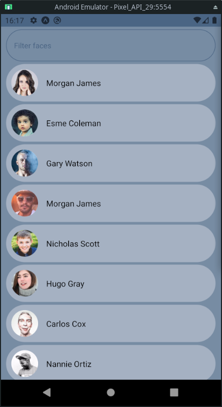

# FaceApp



**This app has been built to showcase the use of different tecnologies**
- React Native
- Expo
- Typescript
- Javascript
- Redux

>Redux, was used because it was requested in the specs of the challenge. I wouldn't normally use it for this kind of scenario.

## Description
FaceApp shows a list of rows containing details of mock people. The avatar and the name are shown.  
When the app loads, it tries to fetch the data from the BE.  
If an error occurs, an error is displayed with some details and a button retry will allow the app to reattempt the fetch.  
A filter is available on the same page of the list of faces. The filter has been modelled on the behaviour of the Google Contacts App.  

## Use

### Install expo
```bash
npm install --global expo-cli
```

### Start the app locally
```bash
npm i
expo start
```
If you are trying to use the BE hosted on localhost, you'll need to get your machine's local IP and change the constant `localIP` in the file: `redux/faceList.ts`

>If the app is run locally and the local IP is not set, an error will be displayed. This is not the best solution...

## Run unit tests
```bash
npm run test
```

>The app can now be opened from the same network using the expo client or from an emulator running on the same machine.

## Using the app with Expo


### Android
Scan this code with the Expo client  


### iOS & Android
<a href="https://expo.io/@iasevoli90/FaceApp">Click here</a> (It's necessary to have the Expo client installed)


>The app will use an instance of the BE running on a free Dyno on Heroku. The first startup of the Dyno could take some seconds.